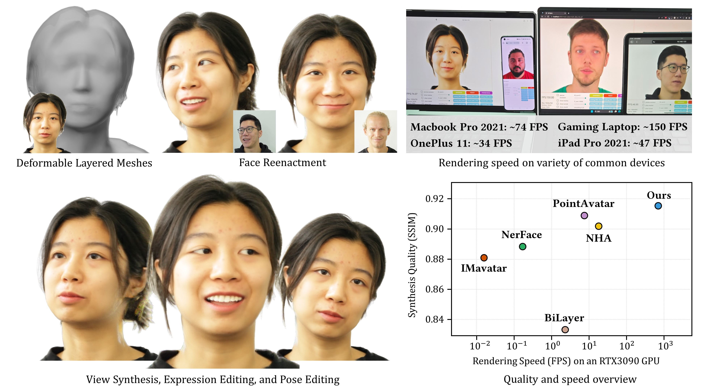

<div align="center">

<h1>BakedAvatar: Baking Neural Fields for Real-Time Head Avatar Synthesis</h1>

<div>
    <a href='' target='_blank'>Hao-Bin Duan<sup>1</sup></a>&emsp;
    <a href='http://miaowang.me/' target='_blank'>Miao Wang<sup>1, 2</sup></a>&emsp;
    <a href='' target='_blank'>Jin-Chuan Shi<sup>1</sup></a>&emsp;
    <a href='' target='_blank'>Xu-Chuan Chen<sup>1</sup></a>&emsp;
    <a href='https://yanpei.me/' target='_blank'>Yan-Pei Cao<sup>3</sup></a>
</div>
<div>
    <sup>1</sup>State Key Laboratory of Virtual Reality Technology and Systems, Beihang University&emsp; 
    <sup>2</sup>Zhongguancun Laboratory&emsp;
    <sup>3</sup>ARC Lab, Tencent PCG
</div>
<div>
    <a href='https://dl.acm.org/doi/10.1145/3618399'>ACM Transactions on Graphics (SIGGRAPH Asia 2023)</a>
</div>
<div>

<a target="_blank" href="https://arxiv.org/abs/2311.05521">
  
</a>
<a href="https://hits.seeyoufarm.com"></a>
</div>


<h4>TL;DR</h4>
<h5>BakedAvatar takes monocular video recordings of a person and produces a mesh-based representation for real-time 4D head avatar synthesis on various devices including mobiles.</h5>

### [Paper](https://dl.acm.org/doi/10.1145/3618399) | [Project Page](https://buaavrcg.github.io/BakedAvatar/)

<br>

<tr>
    
</tr>

</div>


## Setup
First, clone this repo:
```bash
git clone https://github.com/buaavrcg/BakedAvatar
cd BakedAvatar
```

Then, install the required environment. We recommend using [Anaconda](https://www.anaconda.com/) to manage your python environment. You can setup the required environment by the following commands:
```bash
conda env create -f environment.yml
conda activate BakedAvatar
```

Or you can setup the required environment manually:
```bash
conda create -n BakedAvatar python=3.10
conda activate BakedAvatar
# Install Pytorch (or follow specific instructions for your GPU on https://pytorch.org/get-started/locally/)
conda install pytorch torchvision pytorch-cuda=11.8 -c pytorch -c nvidia
# Install various required libraries
pip install accelerate configargparse chumpy opencv-python pymeshlab trimesh scikit-image xatlas matplotlib tensorboard tqdm torchmetrics face-alignment
# Install Pytorch3D (Or follow instructions in https://github.com/facebookresearch/pytorch3d/blob/main/INSTALL.md)
conda install pytorch3d -c pytorch3d  # Linux only
# Install nvdiffrast
git clone https://github.com/NVlabs/nvdiffrast
cd nvdiffrast && pip install . && cd ..
# Install mise (for levelset extraction)
pip install Cython && pip install code/utils/libmise/
```

Finally, download [FLAME model](https://flame.is.tue.mpg.de/download.php), choose FLAME 2020 and unzip it, copy 'generic_model.pkl' into ./code/flame/FLAME2020

## Download Training Data
We use the same data format as in [IMavatar](https://github.com/zhengyuf/IMavatar) and [PointAvatar](https://github.com/zhengyuf/PointAvatar).
You can download a preprocessed dataset from [subject 1](https://dataset.ait.ethz.ch/downloads/IMavatar_data/data/yufeng.zip), [subject 2](https://dataset.ait.ethz.ch/downloads/IMavatar_data/data/soubhik.zip).
To generate your own dataset, please follow intructions in the [IMavatar repo](https://github.com/zhengyuf/IMavatar/tree/main/preprocess).

## Train implicit fields (Stage-1)
```bash
# Configure your training (use DDP?), see https://huggingface.co/docs/accelerate for details
accelerate config

cd code
accelerate launch scripts/runner.py -c config/subject1.yaml -t train
```

## Bake meshes and textures (Stage-2)
```bash
# Extract the meshes
accelerate launch scripts/runner.py -c config/subject1.yaml -t mesh_export
# Precompute the textures and export MLP weights
# Note: change the path to the actual mesh_data.pkl path if you use a different config
accelerate launch scripts/runner.py -c config/subject1.yaml -t texture_export --mesh_data_path ../data/experiments/subject1/mesh_export/iter_30000/marching_cube/res_init16_up5/mesh_data.pkl
```

## Fine tuning (Stage-3)
```bash
# Fine-tune the textures with higher resolution (512x512)
accelerate launch scripts/runner.py -c config/subject1.yaml -t fine_tuning --img_res 512 512 --batch_size 1 --mesh_data_path ../data/experiments/subject1/mesh_export/iter_30000/marching_cube/res_init16_up5/mesh_data.pkl
```

## Run evaluation
```bash
# evaluate fine-tuned meshes (result of stage-3)
accelerate launch scripts/runner.py -c config/subject1.yaml -t test --img_res 512 512 --use_finetune_model --mesh_data_path ../data/experiments/subject1/finetune_mesh_data/iter_30000/mesh_data.pkl

# evaluate baked meshes (result of stage-2)
accelerate launch scripts/runner.py -c config/subject1.yaml -t test --img_res 512 512 --use_finetune_model --mesh_data_path ../data/experiments/subject1/mesh_export/iter_30000/marching_cube/res_init16_up5/mesh_data.pkl

# evaluate implicit fields (result of stage-1)
accelerate launch scripts/runner.py -c config/subject1.yaml -t test --img_res 512 512
```

## Export assets and run the real-time web demo
```bash
# export baked meshes and textures
python scripts/unpack_pkl.py ../data/experiments/subject1/finetune_mesh_data/iter_30000/mesh_data.pkl

# export the FLAME parameter sequence for reenactment
# The flame_params.json are from the files in the train and test subfolders
python scripts/export_flame_sequence.py <path to 1st flame_params.json> <path to 2nd flame_params.json> ... --output ./sequence_data
```

Put the exported `mesh_data` directory and `sequence_data` directory into the root of the web demo and start the server.
Make sure that you have installed npm and nodejs, then run the following commands:
```bash
cd web_demo
npm install
npm run build
npm install --global serve
serve
```
Then, open your browser and visit `http://localhost:8080/`.

## Citation
If you find our code or paper useful, please cite as:
```
@article{bakedavatar,
  author = {Duan, Hao-Bin and Wang, Miao and Shi, Jin-Chuan and Chen, Xu-Chuan and Cao, Yan-Pei},
  title = {BakedAvatar: Baking Neural Fields for Real-Time Head Avatar Synthesis},
  year = {2023},
  issue_date = {December 2023},
  publisher = {Association for Computing Machinery},
  address = {New York, NY, USA},
  url = {https://doi.org/10.1145/3618399},
  doi = {10.1145/3618399},
  volume = {42},
  number = {6},
  journal = {ACM Trans. Graph.},
  month = {sep},
  articleno = {225},
  numpages = {14}
}
```